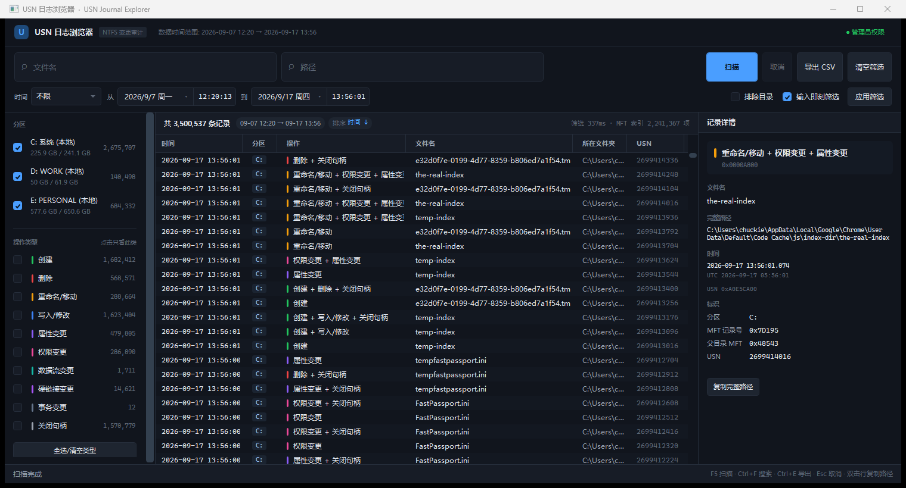

# USN 日志浏览器

NTFS 的 USN 变更日志查看器。想知道某块盘上谁在什么时候动了哪些文件，用它。

[English](README.en.md) · 中文



Windows 10/11 · .NET 8 · WPF · 需管理员权限

## USN 日志

NTFS 会给每个卷记一份变更流水账，文件路径是 `C:\$Extend\$UsnJrnl:$J`。文件的新建、删除、改名、写入、改属性都会记进去。

这个文件用普通文件 API 打不开，也不只是权限问题——以管理员身份运行、并启用 `SeBackupPrivilege` 和 `SeRestorePrivilege` 之后，依然是访问被拒。换哪种路径写法都一样：

```
C:\$Extend\$UsnJrnl:$J
\\?\C:\$Extend\$UsnJrnl:$J
\\.\C:\$Extend\$UsnJrnl:$J
\\?\Volume{guid}\$Extend\$UsnJrnl:$J
```

只能打开卷句柄，用 FSCTL 读：

```
FSCTL_QUERY_USN_JOURNAL   0x000900F4   日志配置
FSCTL_READ_USN_JOURNAL    0x000900BB   变更记录
FSCTL_ENUM_USN_DATA       0x000900B3   枚举 MFT 条目
```

## 路径是还原出来的

USN 记录里只有文件引用号、父目录引用号，以及变更当时的文件名——没有路径。而且那个文件名是快照：文件后来改了名，记录里留的还是老名字。

所以完整路径得自己拼。枚举整块盘的 MFT 建一张「文件号 → 父目录 + 名字」的表，再从记录往上回溯到根目录。中间某个目录已经删掉了，路径就断在那里，界面会标出来，不会瞎接一个。

## 运行

```
publish\UsnExplorer.exe
```

启动会请求管理员权限，之后自动扫描所有 NTFS 分区。

从源码构建（需要 .NET 8 SDK）：

```
build.cmd
```

产物是 `publish\UsnExplorer.exe`，单文件 270KB，用已安装的 .NET 8 桌面运行时。

命令行加 `--selftest` 可以不开界面跑一遍引擎自检，打印日志配置、记录数、耗时和路径解析成功率。

## 功能

- 自动发现 NTFS 分区并读取各自的日志
- 文件名关键词、路径关键词分开筛选，不区分大小写，输入即生效
- 日期加精确到秒的时间范围，带常用区间快捷选项
- 按操作类型筛：创建 / 删除 / 重命名 / 写入 / 属性 / 权限 / 数据流 / 硬链接 / 事务 / 关闭句柄
- 按分区筛，可排除目录
- 点击列标题排序，排序期间界面不卡
- 详情面板显示完整路径、本地与 UTC 时间、MFT 记录号、原始 reason 位图
- 导出当前筛选结果为 CSV
- 快捷键：`F5` 扫描 · `Ctrl+F` 文件名 · `Ctrl+Shift+F` 路径 · `Ctrl+E` 导出 · `Esc` 取消 · 双击行复制路径

## 性能

本机实测（NVMe，264 万条记录、138 万条 MFT 条目）：

```
读日志      2,644,894 条   886 ms
MFT 枚举    1,377,396 项   2.3 s
路径解析    100%（抽样 2000 条）
筛选        全量 < 400 ms
按时间排序  ~200 ms
```

记录全量常驻内存，260 万条约 450MB。这个量级下不做分页和落盘索引，换来的是筛选没有延迟。

## 已知边界

- 只支持 NTFS，exFAT 和 FAT32 没有 USN 日志。
- 日志是环形缓冲，写满 `MaxSize`（通常 256MB）后最旧的记录被覆盖，所以只有最近一段历史。清空日志会不可恢复地丢掉全部历史，Everything 这类依赖它的工具会被迫全盘重扫。
- 文件报告的逻辑长度一直显示得很大（约 2.5GB），实际占用停在 262MB 左右。它是稀疏文件，逻辑长度只增不减，真实磁盘成本是 256MB 上限加一个增长步长。
- 祖先目录已删除的路径无法还原，会显示成 `<已删除>`。
- 筛选结果超过 2000 万行会截断，界面会提示，不会静默丢弃。
- 只读，不会修改或清空日志。

## 许可

[选择性自由许可证 (SFL) v1.0](LICENSE) —— [中文版](LICENSE-CN.md)

MIT 式授权，附加排除条款：不向华为技术有限公司及其关联公司、子公司、员工、代表和承包商授予任何许可。详见 [LICENSE](LICENSE)。

## 几个坑

写这类工具容易踩的地方，都是静默出错：

- `READ_USN_JOURNAL_DATA_V0` 是 40 字节（`<QIIQQQ>`），不是 48。传错尺寸返回 0 字节输出，没有记录。
- `USN_RECORD_V2` 头是 60 字节（`<IHHQQQQIIIIHH>`）。版本号各 2 字节，写成 4 字节的话后面每个字段都错位。
- 时间戳是 FILETIME，自 1601 年起算；`DateTime.Ticks` 自 0001 年起算。直接套用会每个时间差 1600 年，而且看起来仍像个正常日期。
- `TOKEN_PRIVILEGES` 是 16 字节。`LUID` 虽然 8 字节但按 4 字节对齐，声明成 8 字节整数会算成 24 字节，特权启用静默失败。
